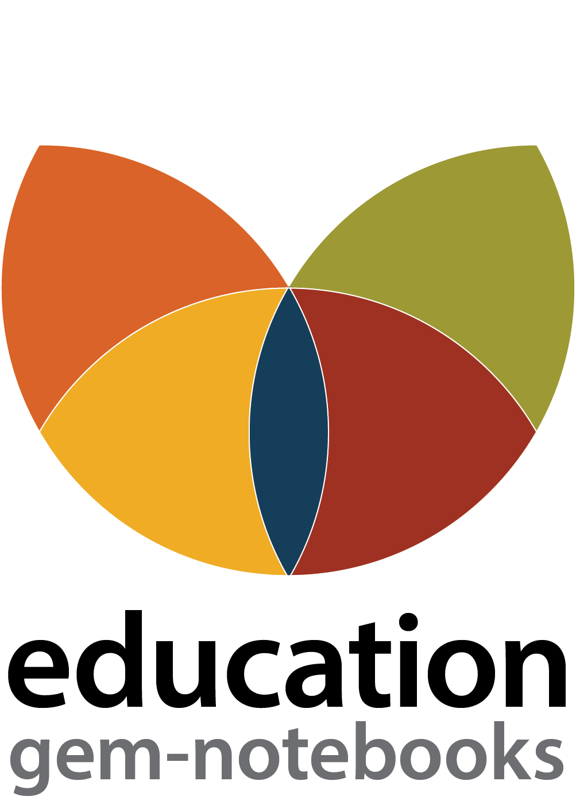

 &nbsp;&nbsp;

 

# Geodynamics Education Modules
The aim of this initiative is to develop modular teaching resources for upper division and graduate level geodynamic courses. By integrating computing methods and tools in a Jupyter Notebook environment to teach geodynamical concepts, these resources enable and promote the training of a computationally skilled workforce and increase awareness and recruitment of students to the Earth Sciences disciplines and specifically computational geodynamics.

For more information about the philosophy and content of these notebooks, please refer to the documentation INSERT LINK HERE.

This initiative is led by the [Computational Infrastructure for Geodynamics](https://geodynamics.org/) and is overseen by an Education Working Group ([EWG](https://geodynamics.org/groups/education)).

## Contributing
GEM notebooks are a community initiative. We welcome all contributions in supporting education in geodynamics. Please feel free to correct things as small as typos or make larger contributions such as added examples and additional modules.

We have collected a set of guidelines and advice on how to contribute and keep them in the CONTRIBUTING.md INSERT LINK HERE file in this repository.

Have an idea for a new module? Open an issue!

##  Education Working Group
The Education Working Group ([EWG](https://geodynamics.org/groups/education)) works to promote access to educational materials for geodynamics. The EWG advances the infrastructure and content needed to develop a computationally skilled workforce and increase discovery of the discipline. This is achieved through integrating computation with domain science in upper division and graduate level learning.

Committee members:

Juliane Dannberg, GEOMAR Helmholtz Centre for Ocean Research ([0000-0003-0357-7115](https://orcid.org/0000-0003-0357-7115)) \
Adam Holt, University of Miami ([0000-0002-7259-0279](https://orcid.org/0000-0002-7259-0279)) \
Lorraine Hwang, University of California, Davis ([0000-0002-1021-3101](https://orcid.org/0000-0002-1021-3101)) \
Gabriele Morra, University of Louisiana at Lafayette ([0000-0002-0787-6107](https://orcid.org/0000-0002-0787-6107)) \
John Naliboff, New Mexico Tech ([0000-0002-5697-7203](https://orcid.org/0000-0002-5697-7203))\
Max Rudolph, University of California, Davis\
Sarah Stamps, Virginia Tech ([0000-0002-3531-1752](https://orcid.org/0000-0002-3531-1752))\
Iris van Zelst, University of Edinburgh ([0000-0003-4698-9910](https://orcid.org/0000-0003-4698-9910))  

 
 

 &nbsp;&nbsp;

 

 

 

>> Note: Currently, the .prm files in these education modules have only been tested to work with ASPECT version 3.1.0-pre, which is the last major ASPECT release and the version of ASPECT available in the ASPECT Docker container. The .prm files used in these education modules might not work with the latest main branch commit of ASPECT.

 

