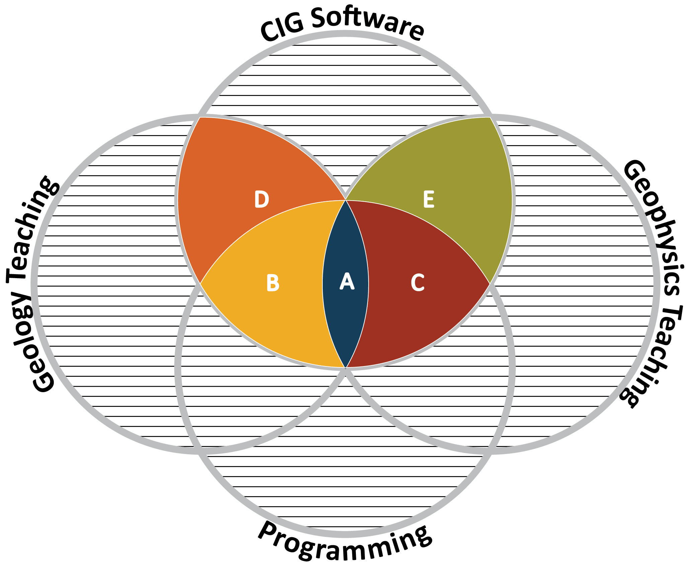
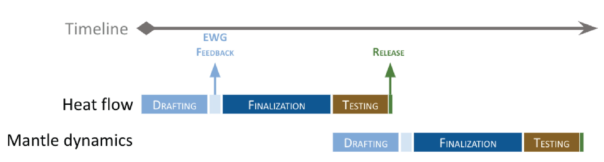

====================
Preface
====================

Background
----------------------------
This project was initiated by the  CIG Education Working Group (`EWG`_), 
which identified significant overlap between geodynamics teaching, programming, and CIG software.
At that time, the group recognized traditionally,
teaching has been organized along two paths. 
The geology path focuses on qualitative to semi-quantitative understanding of Earth and planetary processes, 
where students encounter the governing equations but are not expected to solve them. 
The geophysics path is more quantitative, requiring a strong physics background and emphasizing deriving and solving those equations.

graduate and postgraduate programs.

The group identified initial key topics in geodynamics utilizing Jupyter notebooks for deployment.

Topics covered
----------------------------

.. table:: 
    :widths: auto
    :align: center

    +-----------------------------+-------------------------------------------------------------+
    | Modules                     | Topics                                                      |
    +=============================+=============================================================+
    | 101 modeling                | - Physical model                                            |
    |                             | - Numerical model                                           |
    | (van Zelst  et al. (2022))  | - Code verification                                         |
    |                             | - Model setup                                               |
    |                             | - Model validation                                          |
    |                             | - Model analysis                                            |
    |                             | - Communicating modeling results                            |
    |                             | - Software, data, and resource management                   |
    +-----------------------------+-------------------------------------------------------------+
    | Heat flow                   | - Radiogenic heat/crustal composition                       |
    |                             | - Mantle temperature                                        |
    |                             | - Surface heat flow in the oceans (half-space cooling,      |
    |                             |   plate model)                                              |
    +-----------------------------+-------------------------------------------------------------+
    | Mantle dynamics             | - Global mantle flow                                        |
    |                             | - Plate driving forces                                      |
    |                             | - Earth chemical evolution                                  |
    |                             | - Non-dimensional numbers, e.g., Rayleigh number, Nusselt   |
    |                             |   number, scaling for simple convection                     |
    |                             | - Different tectonic regimes (mobile lid, stagnant lid,     |
    |                             |   heat piping, etc) / regime diagrams                       |
    |                             | - Mantle plumes                                             |
    +-----------------------------+-------------------------------------------------------------+
    | Elasticity & flexure        | - Loading-Induced Deformation                               |
    |                             | - Elastic Rebound Theory                                    |
    +-----------------------------+-------------------------------------------------------------+
    | Stress & strain             | - An introduction to tensors                                |
    |                             | - Measuring stress and strain                               |
    |                             | - Simple stress-strain relationships                        |
    |                             | - Time scales and links to earthquake seismology            |
    +-----------------------------+-------------------------------------------------------------+
    | Rheology                    | - Viscous Flow                                              |
    |                             | - Brittle Failure                                           |
    |                             | - Elasticity                                                |
    |                             | - Composite rheologies                                      |
    +-----------------------------+-------------------------------------------------------------+
    | Phase transition            | - Clapeyron slopes / exothermic vs. endothermic Melt        |
    +-----------------------------+-------------------------------------------------------------+
    | Melt                        | - Generation & partitioning                                 |
    |                             | - Extrusive vs intrusive                                    |
    |                             | - Outgassing of volatiles and coupling with atmospheric     |
    |                             |   studies                                                   |
    +-----------------------------+-------------------------------------------------------------+
    | Rifting                     | - Continental rifts                                         |
    |                             | - Mid-oceanic ridges                                        |
    |                             | - Initial heterogeneities (what are they? initial &         |
    |                             |   boundary conditions and their effects)                    |
    +-----------------------------+-------------------------------------------------------------+
    | Subduction                  | - Upper plate deformation (mountains vs. back-arcs)         |
    |                             | - Subduction zone forces (e.g., slab pull, ridge push)      | 
    |                             | - Thermal structure and relation to other topics            |
    |                             |   (earthquake locations, tomography etc)                    |
    +-----------------------------+-------------------------------------------------------------+

Notebook Structure
--------------------

Each notebook covers the scientific background of a geodynamic process, 
its governing equations, and the computational skills needed to model the process. 
Where analytical solutions exist, notebooks include an analytical section 
for students to solve the governing equations using Python. 
All notebooks include a numerical modeling section where students apply CIG software 
to simulate the concept computationally.

Notebook template
^^^^^^^^^^^^^^^^^^^^^^
The typical notebook should include:

1. Summary section, to introduce the geodynamic topic and the governing physics equations.

2. Analytical section, where the governing equations of the geodynamic concept are solved/modeled  analytically. This would allow the student to acquire and apply pythonic skills.

3. Numerical  section, where the geodynamic topic is addressed numerically using CIG software. This would allow the student to acquire and apply computational modeling skills.

Development strategy
----------------------------

The development of these notebooks will consist of three distinct steps:

1. **Drafting:** an outline of the notebook will be made capturing the content of each of the above-mentioned sections. The draft will be shared with the Education Working Group (EWG) for feedback.

2. **Finalization:** the notebook will be finalized based on the feedback provided by the EWG. 

3. **Testing:** the finalized notebook is tested and, upon EWG approval, released.

The development timeline will be topic-dependent and should be assessed on a case-by-case basis. For instance, the heat flow notebook (foundation level) took ca. 10 weeks to develop:

- Drafting: 1 week.
- EWG feedback: 4 weeks (this could be reduced down to 1-2 weeks and will depend on the EWG availability and engagement).
- Finalization: 2 weeks.
- Testing: 3 weeks (like the initial feedback phase, this will depend on the EWG availability and engagement).

Education Working Group
----------------------------
The Education Working Group (`EWG`_) works to promote access to educational materials for geodynamics. The EWG advances the infrastructure and content needed to develop a computationally skilled workforce and increase discovery of the discipline. This is achieved through integrating computation with domain science in upper division and graduate level learning.

**Committee members:**

- Juliane Dannberg (Geomar Helmholtz Centre for Ocean Research Kiel)

- Mohamed Gouiza (University of Leeds)

- Adam Holt (University of Miami)

- Lorraine Hwang (University of California, Davis)

- Gabriele Morra (University of Louisiana at Lafayette)

- John Naliboff (New Mexico Tech)

- Max Rudolph (University of California, Davis)

- Sarah Stamps (Virginia Tech)

- Iris van Zelst (German Aerospace Center, DLR)

.. _EWG: https://geodynamics.org/groups/education
